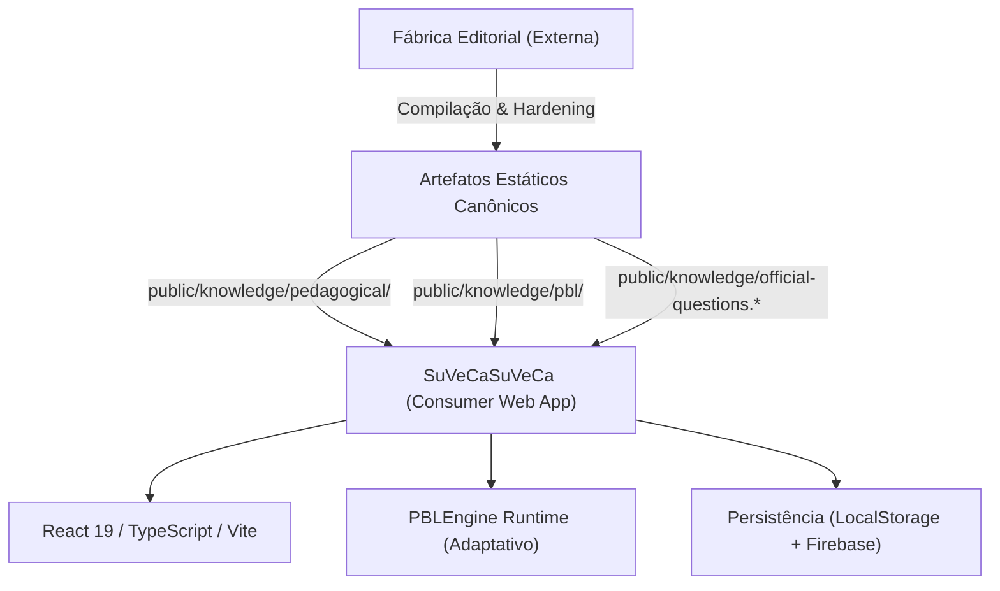

# Guia de Contexto e Arquitetura: SuVeCaSuVeCa no Google AI Studio

Este documento serve como mapa de bordo e autoridade arquitetural para agentes de IA e desenvolvedores que operam no projeto **SuVeCaSuVeCa** dentro do Google AI Studio.

---

## 1. Visão Geral do Produto e Separação Arquitetural

O **SuVeCa** é uma plataforma web adaptativa para o aprendizado de Língua Portuguesa voltada para concursos de alto rendimento. O método central que organiza a experiência sintática é o mapa **SuVeCA = Sujeito + Verbo + Complemento + Adjunto + Predicativo**.



### Princípio da Separação Fábrica vs. Consumidor
- **Fábrica Editorial (Externa / Notebook LM)**: Produz e homologa os datasets curriculares, árvores de decisão, roteiros e inteligência pedagógica.
- **SuVeCaSuVeCa (Este Repositório)**: É o **consumidor web autônomo**. Não fabrica dados em tempo de execução; consome os artefatos estáticos validados em `public/knowledge/`.
- O repositório no GitHub é **100% autocontido**: não requer acessos ou scripts de fábricas externas.

---

## 2. Estrutura Curricular das 115 Unidades

O currículo é composto por **15 módulos (A00 a A14)** totalizando **115 unidades de estudo**:

1. **Aulas 00 a 13 (102 Unidades Regulares)**:
   - Base normativa de Língua Portuguesa (Fonética, Morfologia, Verbos, Transitividade, Sintaxe da Oração, Período Composto, Pontuação, Concordância, Regência/Crase, Coesão, Semântica e Interpretação de Texto).
   - Cada unidade possui 11 seções pedagógicas canônicas.
2. **Aula 14 (13 Unidades de Revisão Cumulativa Espiral — `A14-S01` a `A14-S13`)**:
   - Não introduz novas matérias nem cria questões inéditas.
   - Consolida revisões espirais sobre as matérias anteriores, avaliando pré-requisitos e conexões transversais.

---

## 3. O Contrato das 11 Seções Pedagógicas

Cada unidade regular em `public/knowledge/pedagogical/units/` possui uma estrutura estrita de 11 seções renderizadas pelo `PedagogicalUnitRenderer.tsx`:

1. `visao_geral`: Resumo estruturante do microtema e mapa de conceitos.
2. `regras_decisivas`: A regra normativa determinante cobrada em bancas.
3. `exemplos_comentados`: Casos resolvidos com desmembramento passo a passo.
4. `contrastes_cognitivos`: Quadro de oposição (Polo A $	imes$ Polo B) para evitar confusão entre estruturas semelhantes.
5. `pegadinhas_e_armadilhas`: Atratores típicos de bancas e armadilhas semânticas.
6. `roteiro_decisorio`: Algoritmo procedimental determinístico de resolução.
7. `pratica_guiada`: Exercícios comentados com scaffolding pedagógico.
8. `questoes_oficiais`: Seleção de questões de prova reais com resolução SuVeCA.
9. `flashcards_ativos`: Cartões de repetição espaçada integrados ao Daily Review.
10. `resumo_mnemonico`: Fórmulas de memorização e âncoras rápidas.
11. `conexoes_metodologicas`: Vínculo explícito com o Método SuVeCA (Su-Ve-C-A-Pred).

---

## 4. Motor de Renderização e Componentes Visuais

- **`PedagogicalUnitRenderer.tsx`**: Converte o Markdown/AST estruturado das unidades em seções interativas com suporte a fórmulas KaTeX e destaques sintáticos.
- **`CumulativeReviewRenderer.tsx`**: Renderiza a interface das revisões cumulativas da Camada A14 com progressão espiral.
- **`StudyVisuals` (`src/components/study-visuals/`)**: Componentes de desmembração sintática (blocos de sujeito, verbo, complemento, adjunto e predicativo com cores e tokens temáticos).

---

## 5. Arquitetura do PBL Engine Runtime

O **PBLEngine** (`src/lib/pbl/`) é o motor de Aprendizagem Baseada em Problemas adaptativo:

```text
Sessão PBL
├── SessionPlanner: Planejamento por aula ou revisão espiral A14
├── CaseSelector: Seleção do caso-âncora oficial mais adequado
├── AttemptEvaluator: Avaliação em 4 quadrantes (Correção × Confiança)
├── DiagnosticResolver: Mapeamento de armadilha e misconception
├── InterventionPlanner: Microaula focada (Regra + Procedimento + Contraste)
├── TransferSelector: 5 tiers adaptativos (Isomórfico -> Invertido)
├── MasteryUpdater: BKT (Bayesian Knowledge Tracing) + Rule-Based
└── NextActionPolicy: Roteamento da próxima ação pedagógica
```

- **Datasets PBL (`public/knowledge/pbl/`)**:
  - `pbl_manifest.json`: Manifesto de integridade v3.0.
  - `pbl_competency_map.json`: 190 microcompetências mapeadas nas 102 unidades e 190 LOs.
  - `pbl_cases.json`: 190 casos-âncora oficiais.
  - `pbl_transfer_sets.json`: 190 transfer sets com 1.476 itens de transferência.
  - `pbl_diagnostic_paths.json`: 190 trilhas diagnósticas com 942 nós de decisão.
  - `pbl_cumulative_review_sessions.json`: 13 sessões espirais da Camada A14.
  - `question_competency_links.json`: 2.588 links desnormalizados (100% Direct Match).
  - `question_pedagogy_index.json`: 2.588 registros de Question Intelligence.

---

## 6. Persistência e Subsistemas Integrados

A aplicação opera em modo duplo (**Autenticado via Firebase** ou **Visitante via LocalStorage**):

1. **Caderno de Erros (`CadernoDeErros.tsx`)**:
   - Registra erros com metadados `{ moduloId, questaoId, regraDecisiva, origem: 'pbl' | 'simulado' | 'apostila' }`.
   - Permite refazer questões erradas e acompanhar status de domínio.
2. **Estatísticas (`StatisticsDashboard.tsx`)**:
   - Captura todas as tentativas via `useLearningMetrics`, alimentando gráficos de desempenho, taxa de acerto por aula e tempo médio.
3. **Daily Review (`DailyReviewDashboard.tsx`)**:
   - Agenda revisões espaçadas baseadas no algoritmo SuperMemo-2 / FSRS e nos intervalos recomendados pelo motor de Mastery do PBL (`nextReviewRecommendedAt`).
4. **XP, Nível e Streak (`useAchievements.ts`)**:
   - Conclusão de sessões PBL, leitura de seções e resolução de questões creditam XP e mantêm o streak diário de estudos.

---

## 7. Diretrizes de Modificação no Google AI Studio

### O QUE VOCÊ PODE ALTERAR LIVREMENTE:
- ✅ Layout, temas, paletas de cores, CSS/Tailwind e tipografia.
- ✅ Composição visual, espaçamento, animações e responsividade (mobile/tablet/desktop).
- ✅ Ergonomia de botões, modais, gavetas e feedback visual de interação.
- ✅ Componentes visuais auxiliares (gráficos, timers, contadores).
- ✅ Criação de novas ferramentas ou abas secundárias, mantendo a interoperabilidade.

### O QUE VOCÊ NÃO DEVE ALTERAR SILENCIOSAMENTE:
- ❌ **Dados Oficiais**: Enunciados de questões, alternativas, gabaritos e comentários em `public/knowledge/`.
- ❌ **Identidade Curricular**: A correspondência exata entre A00–A13, temas, unidades e Learning Objectives.
- ❌ **Contratos do PBL Engine**: As interfaces em `src/types/pbl.ts` (`IPBLRepository`, `PBLSession`, `PBLAttempt`, etc.).
- ❌ **IDs Canônicos**: Identificadores de questões (`OQ-...`), competências (`COMP-...`), casos (`PBL-CASE-...`), regras (`RULE-...`), procedimentos (`PROC-...`) e armadilhas (`WARN-...`).
- ❌ **Semântica das 11 Seções**: A ordem lógica e significado das seções da apostila.
- ❌ **Contratos de Persistência e Eventos**: Os esquemas de gravação no Firestore e LocalStorage.

---

## 8. Comandos de Verificação e Segurança

Sempre que realizar alterações no Google AI Studio, valide a estabilidade do projeto executando:

```bash
# Executa os 8 gates de pré-voo do AI Studio
npm run ai-studio:preflight
```
